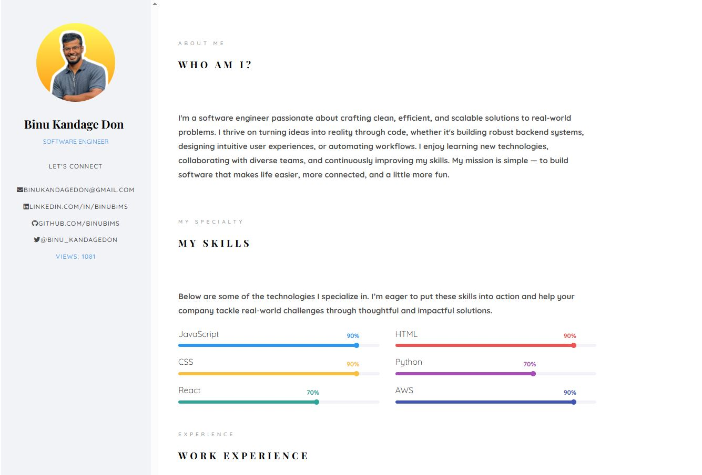

# My Portfolio 💻✨

I built a personal portfolio website to showcase my recent projects, blogs, and certifications. The site is fully **mobile responsive** and includes subtle animations to improve user experience.  

**Project Link:** [Visit My Site](https://binukandagedon.net/)  

---

## How It’s Made

**Tech Stack:** HTML, CSS, JavaScript  

To run the project locally:  
1. Fork the repository  
2. Open `index.html` in your browser  
3. Or run a local server if needed for testing animations  

---

## Features

- Fully **mobile responsive** layout  
- Interactive animations for smooth navigation and hover effects  
- Sections for recent **projects**, **blogs**, and **certifications**  
- Easy navigation with clear layout and visual cues  

---

## Lessons Learned

- Improved skills in **responsive design** for multiple devices  
- Practiced adding **animations** to enhance user experience  
- Gained experience structuring a **personal portfolio** with clean, accessible HTML and CSS  
- Learned to organize content to highlight projects, blogs, and certifications effectively  
